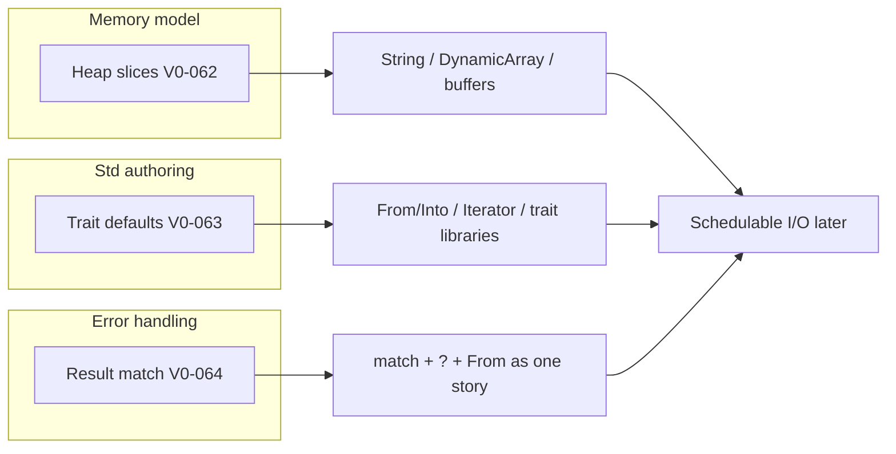
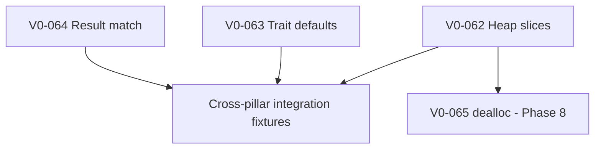

# Language v0 MVP completion roadmap

Status: Active — closes the gap between **Phases 1–6 shipped** and a **credible std platform**.

**Authority:** Language semantics come from the design docs. This file sequences the remaining compiler work and defines acceptance criteria. If behavior is ambiguous, update the relevant design doc first — do not invent semantics in implementation.

**Relationship to other checklists:**


| Document                                                              | Role                                                                          |
| --------------------------------------------------------------------- | ----------------------------------------------------------------------------- |
| [language-v0.md](language-v0.md)                                      | Original Phases 1–6 checklist (most items marked done)                        |
| [mvp-implementation-checklist.md](../mvp-implementation-checklist.md) | Implementation audit matrix and pipeline map                                  |
| **This file**                                                         | Focused completion plan for the highest-leverage **partials** blocking Std v0 |


---

## Why this roadmap exists

Phoenix has a working end-to-end pipeline: parse → resolve → type-check → lower → PHX0 → verify → VM. Phases 1–6 of [language-v0.md](language-v0.md) are largely complete — modules, generics, std bootstrap, heap `ALLOC`, `Option`/`Result`/`?`, core traits, `Drop`, iterators, and contributor examples all ship.

What remains is not random polish. Three **partials** sit between “demo compiler” and “credible std platform”: each one closes a gap between what the **design docs already promise** and what the **compiler actually delivers**.




**Language v0 MVP completion** = Phases 1–6 **plus** Phase 7 (this document). Only then should the project announce Language v0 and begin **Std v0** authoring in earnest (`DynamicArray`, owned `String`, allocator trait libraries).

---

## Current state


| Feature                             | Design status                                                                       | Compiler status                                                                   | Checklist ID             |
| ----------------------------------- | ----------------------------------------------------------------------------------- | --------------------------------------------------------------------------------- | ------------------------ |
| **Heap slices**                     | `[T]` is a core `(ptr, len)` view type                                              | Slices only view **stack/arena Arrays** (`arr as [T]`); no slice over heap memory | — (partial in audit)     |
| **Trait default bodies**            | Documented in [traits.md](features/traits.md); grammar parses them                  | Parsed into AST; **no inheritance in typeck/codegen**                             | — (partial in audit)     |
| **Match on multi-payload `Result`** | [error-handling.md](features/error-handling.md) requires `match` / `if const` / `?` | `Option` match solid; `Result<ok, err>` with **two generic parameters** partial   | — (partial in audit)     |
| Heap `ALLOC` intrinsic              | Done (V0-030)                                                                       | Done                                                                              | V0-030                   |
| `dealloc_bytes` / `FREE`            | Documented in design (V0-065)                                                       | Done                                                                              | V0-065                   |
| Pluggable `Allocator` trait         | [allocator.md](features/allocator.md) (V0-066)                                      | Std `Allocator` + `Global` in Phoenix source                                      | V0-066                   |


### What already works (do not re-litigate)

- Stack-backed slices: `fixed_array as [T]` via `MakeSlice` over aggregate arena storage.
- Std `Result` as a two-parameter generic enum in Phoenix source (`std/src/core/result.phx`).
- `?`, `From` conversion (V0-059), and ctors (V0-042) for `Result`.
- `Option<T>` enum `match` in `std_smoke` and related fixtures.
- Trait parse, static dispatch, monomorphization, `#derive`, and empty marker impls.

---

## Definition of done — Language v0 MVP complete

When **all Phase 7 items** pass acceptance and `just pre-commit` is green:


| Outcome                                                                        | Gate        |
| ------------------------------------------------------------------------------ | ----------- |
| Dynamic buffers use `[T]` over heap storage, not raw `*mut u8` + manual length | V0-062      |
| Std traits can provide default method bodies; empty impls inherit behavior     | V0-063      |
| `match` on `Result<T, E>` is as reliable as `Option` match and `?` lowering    | V0-064      |
| `examples/errors` and new fixtures exercise all three pillars together         | Integration |
| Design docs updated where MVP slice / default-body wording was stale           | Docs        |


**Announce Language v0** when Phase 7 is complete. Phase 8 (deallocation) is the first Std v0 compiler prerequisite but does **not** block the Language v0 announcement if Phase 7 is green — document the leak window until V0-065 lands.

---

## How agents should use this list

1. Work **top to bottom** within Phase 7 unless dependencies say otherwise (see dependency graph below).
2. Complete **one checklist item per task** when possible. Each item has an ID (`V0-NNN`), acceptance criteria, implementation order, and doc links.
3. Mark an item done only when acceptance criteria pass and `just pre-commit` is green.
4. Add or extend **tests** (unit, integration, or `tests/cli/fixtures/`) for every observable behavior change.
5. Update the relevant design doc **before** coding when the item changes documented semantics (especially [type-system.md](features/type-system.md) for heap slices).

### Global completion gate

```bash
just pre-commit
just test    # required when compiler passes or VM semantics change
```

---

## Phase 7 — Close Language v0 partials

These three items are **Language v0 gates**. They close partials; they do not add new surface syntax beyond what the grammar already parses.

### Dependency graph




**Recommended order:** V0-064 → V0-063 → V0-062. Result match unblocks error-handling demos immediately; trait defaults unblock std trait ergonomics; heap slices unlock collections work that depends on both.

---

### V0-062 — Heap slices

**Problem:** `[T]` is defined as a `(ptr, len)` fat pointer ([type-system.md](features/type-system.md)), but today `MakeSlice` only builds views over **Arrays in the frame or aggregate arena**. The VM byte heap (`ALLOC`, V0-030) and heap pointer tagging ([vm-linear.md](features/vm-linear.md)) exist, yet users cannot form a `[T]` view over heap-allocated storage.

**Why this is a gate:**

- **Unlocks owned/growable data.** `str` views rodata; `String`, `DynamicArray<T>`, parsers, and I/O buffers need slices over **heap-allocated** storage.
- **One slice abstraction.** Without heap slices, `[T]` is only useful for stack-sized data — which fights the byte-first, no-GC model.
- **Prerequisite for Std v0.** Memory model and std breadth come before scheduler and std I/O ([mvp-implementation-checklist.md](../mvp-implementation-checklist.md)). Heap slices bridge “we have an `ALLOC` opcode” and “users can write std collections.”

**Design authority (update before implementation):**

- Extend [type-system.md](features/type-system.md) slice section: heap-backed slices are `(ptr, len)` views when `ptr` targets VM heap storage (untagged low range per [vm-linear.md](features/vm-linear.md)).
- Document the safe/unsafe boundary for constructing heap slices (likely `unsafe` slice-from-parts or a std helper wrapping provenance checks until owning types exist).
- Do **not** add a second slice type — same `[T]` representation, broader provenance rules.

**Implementation order:**


| Stage        | Work                                                                                                                                       |
| ------------ | ------------------------------------------------------------------------------------------------------------------------------------------ |
| **Design**   | Update `type-system.md` + `vm-linear.md` with heap slice construction rules and verifier preconditions                                     |
| **Typeck**   | Allow `[T]` values whose data pointer resolves to heap offsets; type `[T]` slice exprs from `( *mut T, len )` or documented cast/intrinsic |
| **Lower**    | Emit `MakeSlice` (or documented equivalent) when ptr is heap-tagged; reuse existing slice runtime representation                           |
| **VM**       | Confirm `MakeSlice` + heap `PTR_LOAD`/`PTR_STORE` + slice indexing share one path; bounds-check len against allocation                     |
| **Verifier** | Stack depth and pointer tag rules for heap-origin slices                                                                                   |
| **Tests**    | CLI fixture + integration test                                                                                                             |


**Acceptance criteria:**

- [ ] Program allocates a byte buffer via `alloc_bytes`, forms a `[u8]` slice over it, writes and reads via slice indexing — runs on VM without verifier failure.
- [ ] Existing `slice_from_array.phx` fixture unchanged (stack/arena slices still work).
- [ ] Negative fixture: invalid length or out-of-bounds slice access fails at compile time or runtime with a clean diagnostic (per design).
- [ ] `just pre-commit` green.

**Refs:** [type-system.md](features/type-system.md), [vm-linear.md](features/vm-linear.md), [ownership.md](features/ownership.md), V0-030

Status: **Done** (implemented)
---

### V0-063 — Trait default bodies

**Problem:** Traits may declare default method implementations ([traits.md](features/traits.md#default-trait-bodies)). The parser stores them in the AST, but typeck and codegen **do not inherit** defaults into empty `impl` blocks.

**Why this is a gate:**

- **Cuts std boilerplate.** Empty impl blocks like `s32 :: impl :: Zero { }` should inherit `zero()` — today they cannot.
- **Unblocks documented std patterns:**
  - Blanket `Into` from `From` ([traits.md](features/traits.md#conversion-traits-from--into) — explicitly waiting on default bodies)
  - Iterator / `IntoIter` convenience impls
  - Associated-type defaults (still deferred in [grammar-deferred.md](features/grammar-deferred.md) — out of scope here)
- **Keeps traits “real.”** Phoenix sells traits as the mechanism for `Clone`, `PartialEq`, `From`, `Iterator`, and `Drop`. Without defaults, every impl repeats logic the trait already defined.

**Design authority:**

- Default bodies use **static dispatch** — monomorphized at the impl site, same as explicit impl methods.
- Empty `Type :: impl :: Trait { }` inherits all trait methods that have defaults and are not overridden.
- Impl methods that override a default replace it entirely; no `super` dispatch in Language v0.
- Default bodies may call other trait methods on `Self` when bounds are satisfiable at the impl site.

**Implementation order:**


| Stage       | Work                                                                                                                 |
| ----------- | -------------------------------------------------------------------------------------------------------------------- |
| **Typeck**  | When checking `impl`, merge trait default signatures + bodies for missing methods; verify empty impl satisfies trait |
| **Mono**    | Include inherited default methods in monomorphization worklist for generic impls                                     |
| **Lower**   | Lower inherited default bodies as if written in the impl block (or shared IR with mangled symbol)                    |
| **Codegen** | Emit functions for inherited methods; static `Call` targets resolve                                                  |
| **Tests**   | Unit tests in `typeck.rs`, `lower.rs`; std fixture with empty impl                                                   |


**Acceptance criteria:**

- [ ] Trait with default method body + empty `s32 :: impl :: Trait { }` compiles, monomorphizes, and runs calling the default.
- [ ] Impl that overrides a default uses the override; default is not also emitted as duplicate symbol.
- [ ] Diagnostic when impl is empty but trait method has **no** default (missing method error).
- [ ] Optional stretch (same PR or follow-up): `Into` default from `From` in std once both traits and defaults work — document in fixture.
- [ ] `just pre-commit` green.

**Refs:** [traits.md](features/traits.md#default-trait-bodies), [grammar-deferred.md](features/grammar-deferred.md)

Status: **Done** (implemented)
---

### V0-064 — Match on multi-payload `Result`

**Problem:** Std `Result` is a **two-parameter** generic enum:

```phoenix
pub Result :: <ok, err> enum {
    Ok(ok),
    Err(err),
};
```

`Option` match works. `?`, `From` (V0-059), and ctors (V0-042) ship. The audit matrix still marks `match` on std enums as **partial** — specifically **multi-param `Result` scrutinee** binding and exhaustiveness.

**Why this is a gate:**

- **Errors are values — `match` is the primary API.** [error-handling.md](features/error-handling.md) requires callers to handle failures via `match`, `if const` / `if var`, or `?`. Fragile `Result` match breaks the no-exceptions model.
- `**?` shares machinery with `match`.** `?` lowers through `MatchTag` + payload extraction. Gaps in generic `Result` pattern binding surface as broken `?` or wrong exhaustiveness for non-scalar payloads (`Config`, `AppError`, etc.).
- **Two type parameters to substitute.** Unlike `Option<T>`’s one parameter, `Result<ok, err>` must monomorphize **both** payload types in patterns at match sites.
- `**examples/errors` is the intended model.** `match read_config() { Ok(c) => …; Err(e) => … }` should be as reliable as `?` propagation.

**Design authority:**

- Same match semantics as user generic enums with multiple type parameters (V0-022 generic enum match — complete for `Result` specifically).
- Exhaustiveness: `Ok(_)` / `Err(_)` or binding patterns must cover all variants; non-exhaustive match is a compile error with `NonExhaustiveMatch`.
- Payload bindings receive monomorphized types (`Config`, `AppError`, etc.), not erased placeholders.

**Implementation order:**


| Stage       | Work                                                                                                          |
| ----------- | ------------------------------------------------------------------------------------------------------------- |
| **Typeck**  | Generic enum match for 2-param `Result`: scrutinee type, pattern tag dispatch, payload local types after mono |
| **Lower**   | `MatchTag` + payload extract for both `Ok` and `Err` arms; same IR path as `Option` and `?`                   |
| **Codegen** | No new opcodes expected — reuse enum tag/payload opcodes                                                      |
| **Tests**   | Extend `std_smoke`; add `std_result_match.phx`; ensure `examples/errors` match arms type-check and run        |


**Acceptance criteria:**

- [ ] `match result_expr { Ok(v) => …; Err(e) => … }` works when `result_expr: Result<Config, AppError>` (or equivalent fixture types).
- [ ] Non-exhaustive `Result` match rejected at compile time.
- [ ] `if const Ok(x) = expr` / `if var Err(e) = expr` works for two-payload `Result` (same binding rules as `Option`).
- [ ] `?` and explicit `match` on the same `Result` type both pass in one program (`examples/errors` or dedicated fixture).
- [ ] `just pre-commit` green.

**Refs:** [error-handling.md](features/error-handling.md), [language-v0.md](language-v0.md) V0-042, V0-059, [traits.md](features/traits.md)

Status: **Done** (implemented)

---

### V0-067 — Cross-pillar integration (Phase 7 capstone)

**Problem:** Individual fixes can pass in isolation while the “credible std platform” story still fails in realistic programs.

**Acceptance criteria:**

- [ ] New fixture `tests/cli/fixtures/std_platform_smoke/` (or extend `mvp_acceptance/`) demonstrates in one program:
  - `match` on `Result<T, E>` with user-defined error type
  - Trait with default body consumed via empty impl
  - Heap-allocated buffer viewed as `[u8]` slice (inside `unsafe` until owning types ship)
- [ ] `examples/errors` builds and runs via `just test-lang`.
- [ ] [mvp-implementation-checklist.md](../mvp-implementation-checklist.md) audit rows for heap slices, trait defaults, and Result match updated to **pass**.

**Refs:** [language-v0.md](language-v0.md) V0-052

Status: **Done** (implemented)

---

## Phase 8 — Memory model bridge (first Std v0 compiler work)

Phase 8 is **not** a Language v0 announcement blocker if Phase 7 is complete, but it is the **first compiler prerequisite** before authoring `DynamicArray`, `Box`, and owned `String` in Phoenix std. Order: complete Phase 7 first, then Phase 8 before std collections land.

### V0-065 — Heap deallocation (`dealloc_bytes` / `FREE`)

**Problem:** V0-030 ships `ALLOC` only. The VM heap is grow-only; `Drop` glue exists (V0-054) but cannot reclaim heap blocks. Std owning types would leak.

**Work:**


| Stage        | Work                                                                                                                                                        |
| ------------ | ----------------------------------------------------------------------------------------------------------------------------------------------------------- |
| **Design**   | Update [vm-linear.md](features/vm-linear.md), [ownership.md](features/ownership.md), [traits.md](features/traits.md) with `dealloc_bytes` / `FREE` contract |
| **Std**      | `std::core::alloc::dealloc_bytes(ptr, size)` — intrinsic stub like `alloc_bytes`                                                                            |
| **Compiler** | `IntrinsicKernel` entry; `unsafe` required; lowers to `FREE` opcode                                                                                         |
| **VM**       | Bounds-checked free or mark-dead region; verifier rules                                                                                                     |
| **Tests**    | Allocate + dealloc + no double-free diagnostic or runtime error                                                                                             |


**Acceptance:** Program allocates, deallocates in `Drop`, scope exit runs cleanup without leak in test harness; double-free rejected.

Status: **Done** (implemented)

---

### V0-066 — Allocator trait (Std v0 — Phoenix source, not compiler builtin)

**Problem:** Pluggable allocation policy belongs in std, not the language. Design direction: `Allocator` trait in `std::core`, default `Global` wrapping VM heap intrinsics; only `VmHeapAllocator` calls `alloc_bytes` / `dealloc_bytes` directly.

**Work:** Author design section in [ownership.md](features/ownership.md) or new `docs/design/features/allocator.md`. Implement in std **after** V0-065. Generic `DynamicArray<T, A: Allocator = Global>` is Std v0 scope — not a Language v0 compiler item.

**Acceptance:** Document trait shape, `Layout`, orphan rules, and layering (`Allocator` → `Drop` on `Box`). No `Ty::Allocator` in compiler.

Status: **Done** (design + std `Allocator` / `Global` / `VmHeapAllocator`)

---

## Std v0 entry — after Language v0 MVP complete

Once Phase 7 (and preferably V0-065) is done, begin Std v0 authoring per [language-v0.md](language-v0.md#after-language-v0--std-v0-starting-point):


| Order | Module                                       | Depends on                  |
| ----- | -------------------------------------------- | --------------------------- |
| 1     | `core::alloc` wrappers                       | V0-065 (`dealloc`)          |
| 2     | `core::memory::allocator` (trait + `Global`) | V0-066 design               |
| 3     | `collections::dynamic_array`                 | V0-062, V0-065, `Allocator` |
| 4     | `text::String`                               | `DynamicArray<u8>`, `Clone` |
| 5     | `text::fmt`                                  | `String`, `Display`         |


Std I/O (`fs`, `net`) remains blocked on scheduler + schedulable-I/O runtime ([runtime-transparency.md](features/runtime-transparency.md)).

---

## Explicitly out of scope (this roadmap)

Do not expand scope while Phase 7 is open:


| Feature                                            | Why deferred                                                                      |
| -------------------------------------------------- | --------------------------------------------------------------------------------- |
| Scheduler, M:N runtime, actors                     | Post–Language v0; see [concurrency.md](features/concurrency.md)                   |
| Schedulable-I/O type syntax                        | Post–Language v0; see [runtime-transparency.md](features/runtime-transparency.md) |
| Full borrow checker                                | Post-MVP; MVP stays use-after-move                                                |
| `dyn Trait` / vtables                              | Static dispatch only in Language v0                                               |
| Associated-type defaults                           | [grammar-deferred.md](features/grammar-deferred.md)                               |
| Trait supertrait bounds (`Error: Debug + Display`) | Deferred; empty `Error` marker today                                              |
| Pluggable VM heap at opcode level                  | Single VM byte heap; custom allocators are std-side arenas/pools                  |
| Std I/O and networking                             | Requires scheduler                                                                |


---

## Summary checklist


| ID     | Item                             | Phase      | Blocks Language v0 announcement |
| ------ | -------------------------------- | ---------- | ------------------------------- |
| V0-062 | Heap slices                      | 7          | **Yes**                         |
| V0-063 | Trait default bodies             | 7          | **Yes**                         |
| V0-064 | Match on multi-payload `Result`  | 7          | **Yes**                         |
| V0-067 | Cross-pillar integration fixture | 7          | **Yes**                         |
| V0-065 | `dealloc_bytes` / `FREE`         | 8          | No (blocks Std v0 collections)  |
| V0-066 | `Allocator` trait design + std   | 8 / Std v0 | No                              |


---

## Related documents


| Document                                                              | Role                                                         |
| --------------------------------------------------------------------- | ------------------------------------------------------------ |
| [language-v0.md](language-v0.md)                                      | Original Phases 1–6 checklist                                |
| [mvp.md](mvp.md)                                                      | Canonical MVP in/out scope                                   |
| [mvp-implementation-checklist.md](../mvp-implementation-checklist.md) | Implementation audit                                         |
| [type-system.md](features/type-system.md)                             | **Array** / **DynamicArray** naming, slices, generics, casts |
| [traits.md](features/traits.md)                                       | Default bodies, std trait roadmap                            |
| [error-handling.md](features/error-handling.md)                       | `Result`, `match`, `?`                                       |
| [ownership.md](features/ownership.md)                                 | Moves, `Drop`, heap ownership                                |
| [vm-linear.md](features/vm-linear.md)                                 | `ALLOC`, pointer tagging, opcodes                            |


