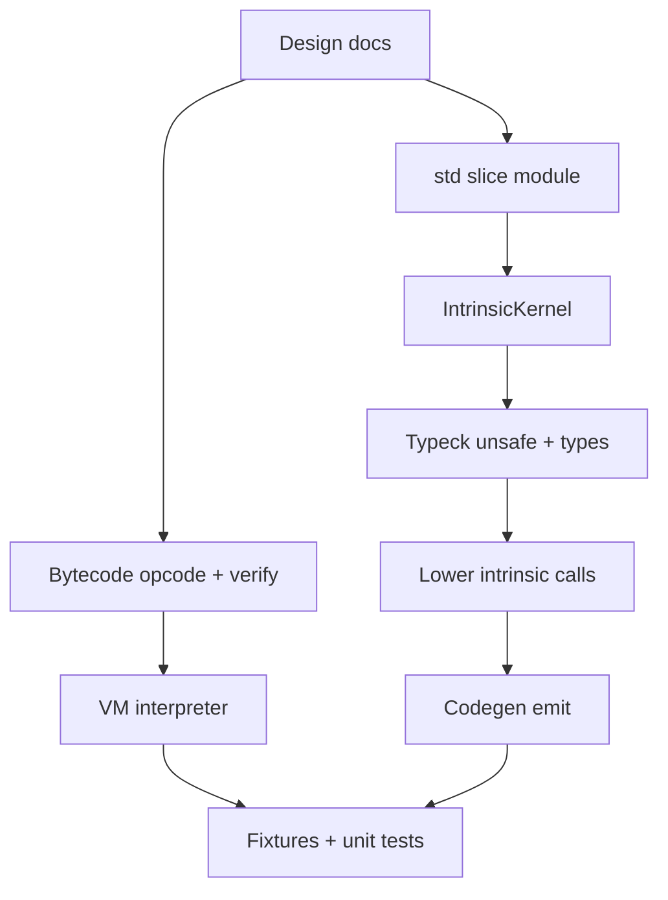
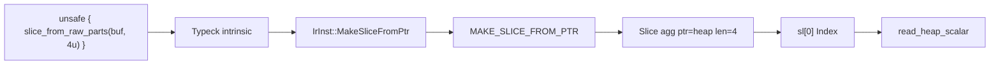

# V0-062 — Heap slices implementation plan

Status: **Done** (implemented)

**Authority:** [language-v0-completion-roadmap.md](../language-v0-completion-roadmap.md) (lines 131–168)

---

## Overview

Enable `[T]` slice values whose data pointer targets **untagged VM heap offsets** from `ALLOC`, using the same slice aggregate representation as stack/arena slices. Construction is **`unsafe`** via a std intrinsic (mirroring `alloc_bytes`); indexing reuses existing `Index` + slice aggregate path after VM teaches `slice_elem_load` about heap pointers.

---

## 1. Design doc updates (do first)

### [type-system.md](../features/type-system.md)

- **Runtime storage / slice section (~L68):** State that slices may view Array arena storage **or** heap bytes when built via `slice_from_raw_parts` inside `unsafe`.
- **Sequence naming table:** Confirm Slice row covers heap provenance.
- **Explicit cast tiers (Tier A):** Keep `[T; N] as [T]` only — do **not** add `*mut T as [T]` (length not in unary cast). Document heap slice construction as std intrinsic, not Tier A cast.
- **New subsection: Heap slice construction**
  - API: `#import std::core::slice::slice_from_raw_parts`
  - Signature: `slice_from_raw_parts :: <T>(ptr: *mut T, len: u32) => [T]` (exact generic spelling per existing std patterns)
  - Callable only inside `unsafe`
  - Caller contract: `ptr` must be valid for `len * size_of(T)` bytes within VM heap (or compatible storage); no compile-time proof of allocation extent in V0-062
  - Same `[T]` type — no second slice type

### [vm-linear.md](../features/vm-linear.md)

- **Runtime value model (~L149):** Document second slice construction path besides `MAKE_SLICE` (array).
- **New opcode `MAKE_SLICE_FROM_PTR` (48):** Stack `[ptr, len: u32] → [slice]`; operand `elem_kind` (wire `PrimitiveKind` or `0xFF`). Slice aggregate stores **untagged** heap `ptr` + runtime `len`.
- **Pointer tagging:** Clarify slice `data_ptr` may be `PTR_CONST_TAG`, `PTR_AGG_TAG`, or **untagged heap offset** (same as `ALLOC` result).
- **Verifier:** Stack effect for new opcode; `elem_kind` operand required.

### [grammar-deferred.md](../features/grammar-deferred.md) (optional one-liner)

- Heap slice surface is std import + intrinsic lowering, not new syntax.

---

## 2. API choice

| Decision | Choice | Rationale |
|---|---|---|
| Module | `std::core::slice` | Separates view construction from `alloc`; parallel to `alloc` / `option` / `result` |
| Function | `slice_from_raw_parts` | Rust-aligned name; encodes ptr + len (unary cast cannot) |
| Safety | `unsafe` required | Same boundary as `alloc_bytes` / `extern "C"` |
| Lowering | Compiler intrinsic → dedicated opcode | Not `IrInst::Call`; body is stub like `alloc.phx` |
| Generics | Monomorphize `T` at call site | `elem_kind` from `T`; reject non-primitive `T` in V0-062 if aggregate heap slices are out of scope |

**Std surface** (`std/src/core/slice.phx`):

```phoenix
// std::core::slice — heap slice intrinsic (compiler-lowering).

pub slice_from_raw_parts :: <T>(ptr: *mut T, len: u32) => [T] {
    const _ = ptr;
    const _ = len;
};
```

Export via `std/src/core/mod.phx` as `pub mod slice`.

**Out of scope for V0-062:** safe wrappers, `DynamicArray::as_slice()`, compile-time len proof, slice over `*mut` to stack locals (use existing array/`MakeSlice` path).

---

## 3. Opcode / IR design

**Recommendation: new opcode `MakeSliceFromPtr = 48`** — do **not** overload `MakeSlice` (41).

| | `MakeSlice` (existing) | `MakeSliceFromPtr` (new) |
|---|---|---|
| Stack in | `[array agg]` | `[ptr: ScalarValue::Ptr, len: u32]` |
| Stack out | `[slice agg]` | `[slice agg]` |
| Operand | `elem_kind` | `elem_kind` |
| `Slice.ptr` | `PTR_AGG_TAG \| handle` | untagged heap offset (or future: other untagged regions) |
| `Slice.len` | array length | runtime `len` |

**IR:** `IrInst::MakeSliceFromPtr { elem_kind: u8 }`

**PHX0:** Bump documented opcode count 48 → 49 in checklist comments only if needed; no format version bump unless section layout changes (it does not).

---

## 4. Pipeline implementation order



### Stage A — Bytecode (`phx-bytecode`)

- [opcode.rs](source/phx-bytecode/src/opcode.rs): `MakeSliceFromPtr = 48`, `from_u8` arm
- [stack_effect.rs](source/phx-bytecode/src/stack_effect.rs): pop ptr + len (2 scalars), push slice agg; net stack +0 with depth ≥ 2
- [verify.rs](source/phx-bytecode/src/verify.rs): operand count = 1 (`elem_kind`); join-stack simulation

### Stage B — VM (`phx-vm`)

- **New opcode handler:** pop `len` (u32), pop `ptr` (Ptr), `push_aggregate(Slice { elem_kind, ptr, len })` — **no tag OR on ptr**
- **`slice_elem_load` heap branch** (after `PTR_AGG_TAG` check, before final error):
  - If ptr has no `PTR_CONST_TAG` / `PTR_AGG_TAG` / `PTR_LOCAL_TAG`: treat as heap offset
  - `elem_size = PrimitiveKind::from_u8(elem_kind)?.byte_size()` (reject `0xFF` agg elements for heap in V0-062)
  - `byte_offset = index * elem_size`; `read_heap_scalar(heap, addr + byte_offset, ...)`
- **Optional:** `slice_elem_store` for heap — not required for acceptance (fixture uses `*buf` or index read); defer unless acceptance needs `sl[i] = v` write path

**Bounds (MVP pragmatic):**

- **Index:** `index < slice.len` → existing `FieldOutOfRange`
- **Element access:** `addr + index * elem_size + elem_size <= heap.len()` → `HeapOutOfBounds`
- **No alloc metadata table** — do not prove `len ≤ allocation size` at runtime beyond heap end checks; document caller responsibility in `type-system.md`

### Stage C — Std + intrinsic kernel (`std`, `phx-compiler`)

- Add `slice.phx`, `mod.phx` export
- [intrinsic_kernel.rs](source/phx-compiler/src/typeck/intrinsic_kernel.rs):
  - Scan `std::core::slice::slice_from_raw_parts`
  - `IntrinsicSite::SliceFromRawParts`
  - `is_intrinsic_fn` skip body typeck/lower
- [typeck/check.rs](source/phx-compiler/src/typeck/check.rs):
  - `check_intrinsic_call`: `unsafe_depth == 0` → `IntrinsicRequiresUnsafe`
  - Arity 2: `ptr: *mut T`, `len: u32`
  - Return `Ty::Slice(elem)` where `elem` matches `T`
  - Reject generic intrinsic calls without mono (same as `alloc_bytes`)
- [lower/expr.rs](source/phx-compiler/src/lower/expr.rs) + [lower/func.rs](source/phx-compiler/src/lower/func.rs): intrinsic call → `IrInst::MakeSliceFromPtr { elem_kind }` (evaluate args left-to-right: ptr, len)
- [codegen/emit.rs](source/phx-compiler/src/codegen/emit.rs): emit opcode 48

### Stage D — Diagnostics

- Reuse `IntrinsicRequiresUnsafe` or add specific message for slice intrinsic
- No new error for OOB at compile time (runtime only unless constant index provably OOB — optional stretch)

---

## 5. Data flow (acceptance program)



Example fixture shape:

```phoenix
#import std::core::alloc::alloc_bytes;
#import std::core::slice::slice_from_raw_parts;

main :: () => {
    unsafe {
        const buf: *mut u8 = alloc_bytes(4u);
        *buf = 77u;
        const sl: [u8] = slice_from_raw_parts(buf, 4u);
        const v: u8 = sl[0];
        const _ = v;  // expect 77
    };
};
```

---

## 6. Tests and acceptance mapping

| Acceptance criterion | Concrete artifact |
|---|---|
| alloc → slice → index read | `tests/cli/fixtures/heap_slice/src/main.phx` + `phoenix.toml` |
| `slice_from_array.phx` unchanged | Run existing fixture in `tests/cli/run.sh` + `run_semantics.rs` |
| Negative OOB | `tests/cli/fixtures/heap_slice_oob/src/main.phx` — `slice_from_raw_parts(buf, 100u)` or `sl[99]` → runtime error, clean exit |
| unsafe required | `tests/cli/fixtures/heap_slice_unsafe/` — call outside `unsafe` fails typeck |
| Unit: typeck | `phx-compiler/tests/typeck.rs` — `slice_from_raw_parts_requires_unsafe`, fixture typechecks |
| Unit: lower | `lower_heap_slice_emits_make_slice_from_ptr_not_call` |
| Unit: codegen | `Opcode::MakeSliceFromPtr` in bytecode |
| Integration | `tests/integration/tests/heap_slice_run.rs` — run + slot/local capture if needed |
| CLI e2e | `tests/integration/tests/cli_e2e.rs` — build/check fixtures |
| Docs audit | Update `mvp-implementation-checklist.md` slices row to **pass** when done |

**Completion gate:** `just pre-commit` + `just test` (compiler/VM changes).

---

## 7. Risks and non-goals

| Risk | Mitigation |
|---|---|
| Tagged ptr mistaken for heap | Check tags in order: LOCAL, CONST, AGG, then heap (document in VM) |
| `elem_kind = 0xFF` on heap | Reject at typeck for V0-062 (only primitive element slices) |
| Slice write via index on heap | Add `slice_elem_store` heap branch if acceptance requires `sl[i] = x`; else document read-only heap slice index for v1 |
| Opcode 48 drift | Single source in `opcode.rs`; update `mvp-implementation-checklist` opcode count |

**Non-goals:** allocation-size registry, `dealloc`, `DynamicArray`, slice over local `AddressOfLocal` pointers, compile-time length validation.

---

## 8. Estimated file checklist

| File | Change |
|---|---|
| `docs/design/features/type-system.md` | Heap slice semantics |
| `docs/design/features/vm-linear.md` | Opcode 48, slice ptr rules |
| `std/src/core/slice.phx` | New intrinsic stub |
| `std/src/core/mod.phx` | `pub mod slice` |
| `source/phx-bytecode/src/opcode.rs` | Opcode 48 |
| `source/phx-bytecode/src/stack_effect.rs` | Stack effect |
| `source/phx-bytecode/src/verify.rs` | Verify rules |
| `source/phx-bytecode/tests/support.rs` | Roundtrip if present |
| `source/phx-vm/src/interpreter.rs` | Opcode + `slice_elem_load` heap |
| `source/phx-compiler/src/ir/inst.rs` | `MakeSliceFromPtr` |
| `source/phx-compiler/src/typeck/intrinsic_kernel.rs` | Discovery |
| `source/phx-compiler/src/typeck/check.rs` | Intrinsic typeck |
| `source/phx-compiler/src/lower/expr.rs` | Lower |
| `source/phx-compiler/src/codegen/emit.rs` | Emit |
| `source/phx-compiler/tests/{typeck,lower,codegen}.rs` | Unit tests |
| `tests/cli/fixtures/heap_slice*` | CLI fixtures |
| `tests/integration/tests/heap_slice_run.rs` | Integration |
| `docs/mvp-implementation-checklist.md` | Status pass |
